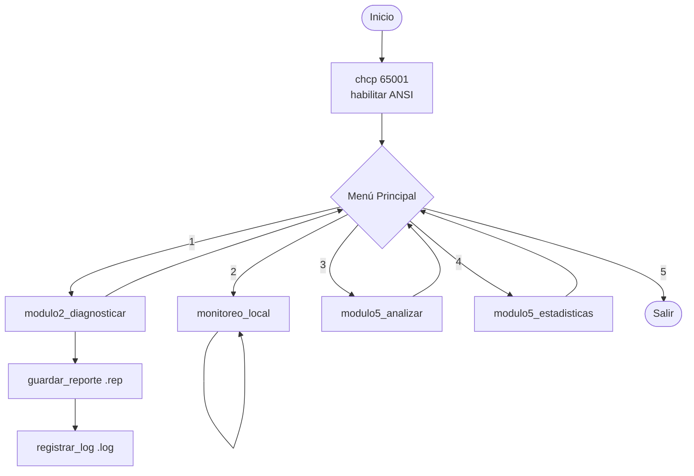

<div align="center">

```
╔══════════════════════════════════════════════╗
║        T E C H S C A N  6 4                 ║
║     Sistema de Diagnostico de Equipos        ║
╚══════════════════════════════════════════════╝
```


-yellow)


**Sistema de diagnóstico de equipos en ensamblador x86-64 + C para Windows.**  
Captura hardware, monitorea en tiempo real, persiste reportes binarios y analiza laboratorios completos.

</div>

---

## 📋 Tabla de Contenidos

- [¿Qué es TechScan64?](#-qué-es-techscan64)
- [Arquitectura del sistema](#-arquitectura-del-sistema)
- [Módulos](#-módulos)
- [Formato de datos](#-formato-de-datos)
- [Requisitos](#-requisitos)
- [Instalación y compilación](#-instalación-y-compilación)
- [Uso desde USB](#-uso-desde-usb)
- [Estructura del repositorio](#-estructura-del-repositorio)
- [Ramas del proyecto](#-ramas-del-proyecto)

---

## 🔍 ¿Qué es TechScan64?

TechScan64 es una aplicación de consola para **Windows 64-bit** que permite:

| Función | Descripción |
|---------|-------------|
| 🖥️ Diagnóstico | Captura CPU, RAM, disco, GPU y placa base del equipo actual |
| 📊 Monitoreo | Refresca métricas en tiempo real con barras ASCII y cálculos FPU |
| 💾 Persistencia | Guarda reportes en formato binario `.rep`, logs `.log` y exporta `.csv` |
| 🔬 Análisis | Lee y compara múltiples equipos, genera lista priorizada de revisión |

Desarrollado como proyecto académico de **Arquitectura de Computadoras** combinando NASM x86-64 y C con WinAPI.

---

## 🏗️ Arquitectura del sistema

```
┌─────────────────────────────────────────────────────────────────┐
│                        techscan64.exe                           │
│                                                                 │
│   ┌─────────────────────────────────────────────────────────┐   │
│   │           MÓDULO 1 — menu.asm  (NASM x86-64)            │   │
│   │                   Punto de entrada main                  │   │
│   │            Menú ANSI + recuadro UTF-8 + ENTER            │   │
│   └──────┬──────────┬──────────┬──────────┬──────────────────┘   │
│          │ op.1     │ op.2     │ op.3     │ op.4                  │
│          ▼          ▼          ▼          ▼                       │
│   ┌──────────┐ ┌──────────┐ ┌──────────┐ ┌──────────────────┐   │
│   │  MOD 2   │ │  MOD 4   │ │  MOD 5   │ │      MOD 5       │   │
│   │modulo2.c │ │monitor   │ │analyzer.c│ │  analyzer.c      │   │
│   │  (C)     │ │  .asm    │ │  (C)     │ │    (C)           │   │
│   │Diagnostico│ │Monitoreo │ │Analizar  │ │ Estadísticas     │   │
│   │ hardware │ │FPU+barras│ │ reportes │ │  globales        │   │
│   └────┬─────┘ └──────────┘ └────┬─────┘ └────────┬─────────┘   │
│        │                         │                │              │
│        └──────────┬──────────────┘                │              │
│                   ▼                               │              │
│   ┌───────────────────────────────────────────────▼──────────┐   │
│   │               MÓDULO 3 — report_io.c  (C)                │   │
│   │    guardar_reporte()  leer_reporte()  registrar_log()     │   │
│   │    exportar_csv()                                         │   │
│   └───────────────────────────────────────────────────────────┘   │
│                              │                                   │
│              ┌───────────────┼───────────────┐                   │
│              ▼               ▼               ▼                   │
│         .rep (binario)  events.log      export.csv               │
└─────────────────────────────────────────────────────────────────┘
```

### Flujo de ejecución



---

## 🧩 Módulos

### Módulo 1 — Interfaz y menú `src/menu.asm`

Escrito en **NASM x86-64**. Es el `main` del programa.

```
╔══════════════════════════════════════════════════╗
║                                                  ║
║             T E C H S C A N  6 4                ║  ← Blanco brillante
║      Sistema de Diagnostico de Equipos           ║  ← Gris tenue
║                                                  ║
╠══════════════════════════════════════════════════╣
║                                                  ║
║  [ 1 ]  Diagnosticar este equipo                 ║  ← Número amarillo
║  [ 2 ]  Monitorear en tiempo real                ║
║  [ 3 ]  Analizar reportes del USB                ║
║  [ 4 ]  Estadisticas globales                    ║
║  [ 5 ]  Salir                                    ║  ← Rojo
║                                                  ║
╚══════════════════════════════════════════════════╝
  >> Seleccione una opcion: _
```

**Funciones internas:**

| Función | Descripción |
|---------|-------------|
| `main` | Punto de entrada, bucle principal |
| `habilitar_ansi` | Activa secuencias ESC via `GetStdHandle` + `SetConsoleMode` |
| `dibujar_menu` | Imprime el recuadro completo con colores ANSI |
| `pausar` | Consume `\n` pendiente y espera ENTER del usuario |

---

### Módulo 2 — Captura de hardware `src/modulo2.c`

Captura información real del equipo usando **WinAPI** e instrucción **CPUID**.

```
==========================================
       DIAGNOSTICO DEL EQUIPO
==========================================
PC           : DESKTOP-ABC123
Usuario      : NayerEulate
SO           : Windows 11 (Build 26200)
Arquitectura : x86_64 (64-bit)
------------------------------------------
CPU          : Intel(R) Core(TM) i7-12700H
Nucleos log. : 20
RAM total    : 16384 MB
RAM libre    : 8192 MB
Disco libre  : 120480 MB
GPU          : NVIDIA GeForce RTX 3060
Placa base   : ROG STRIX B660-A
------------------------------------------
Categoria    : BUENO
Timestamp    : 2026-06-18 00:15:42
==========================================
```

**Fuentes de datos:**

| Dato | API / Método |
|------|-------------|
| Nombre PC | `GetComputerNameA` |
| Usuario activo | `GetUserNameA` |
| Sistema operativo | `RtlGetVersion` (via ntdll) |
| Arquitectura | `GetNativeSystemInfo` |
| Modelo CPU | `CPUID` hojas `0x80000002/3/4` |
| Núcleos lógicos | `CPUID` hoja `1`, `EBX[23:16]` |
| RAM total / libre | `GlobalMemoryStatusEx` |
| Disco libre | `GetDiskFreeSpaceExA` |
| GPU | Registro `HKLM\...\{4d36e968...}\0000` → `DriverDesc` |
| Placa base | Registro `HKLM\HARDWARE\DESCRIPTION\System\BIOS` → `BaseBoardProduct` |

**Clasificación automática:**

```
RAM libre ≥ 50%  →  EXCELENTE (0)
RAM libre ≥ 30%  →  BUENO     (1)
RAM libre ≥ 15%  →  REGULAR   (2)
RAM libre  < 15%  →  CRÍTICO   (3)
```

---

### Módulo 3 — Persistencia `src/report_io.c`

Gestiona archivos binarios `.rep`, eventos `.log` y exportación `.csv`.

#### Formato del archivo `.rep`

```
┌─────────────────────────────────────┐
│         ENCABEZADO (24 bytes)        │
├──────────┬──────────────────────────┤
│ Offset 0 │ firma[4]      "SCAN"     │
│ Offset 4 │ version       uint32 = 1 │
│ Offset 8 │ fecha[12]     "YYYY-MM-DD"│
│ Offset 20│ cant_reg      uint32     │
├─────────────────────────────────────┤
│         REGISTRO (200 bytes)         │
├──────────┬──────────────────────────┤
│ Offset 0 │ id_equipo     uint32     │
│ Offset 4 │ nombre[28]    char[]     │
│ Offset 32│ cpu[32]       char[]     │
│ Offset 64│ ram_total     uint64 MB  │
│ Offset 72│ ram_libre     uint64 MB  │
│ Offset 80│ disco_libre   uint64 MB  │
│ Offset 88│ gpu[32]       char[]     │
│ Offset 120│ placa[32]    char[]     │
│ Offset 152│ uso_ram_pct  double FPU │
│ Offset 160│ uso_cpu_pct  double FPU │
│ Offset 168│ nucleos      uint32     │
│ Offset 172│ categoria    uint32     │
│ Offset 176│ timestamp[24] char[]    │
└─────────────────────────────────────┘
     Total archivo: 224 bytes
```

> `#pragma pack(1)` garantiza que los offsets sean idénticos entre los módulos C y ASM.

**Funciones:**

| Función | Descripción |
|---------|-------------|
| `guardar_reporte()` | Escribe encabezado + registro en `.rep` |
| `leer_reporte()` | Lee y valida firma `"SCAN"` antes de cargar |
| `registrar_log()` | Append a `events.log` con timestamp real |
| `exportar_csv()` | Genera `.csv` con cabeceras para análisis externo |

---

### Módulo 4 — Monitoreo en tiempo real `src/monitor.asm`

Escrito en **NASM x86-64** con instrucciones de punto flotante x87 FPU.

```
==========================================
   TECHSCAN64 - MONITOREO EN TIEMPO REAL
==========================================
Ultima actualizacion: 2026-06-18 00:15:42

RAM Total: 16384 MB  |  RAM Libre: 8192 MB  |  En uso: 50%
RAM en uso:    [██████████░░░░░░░░░░]

Disco Total: 512000 MB | Disco Libre: 120480 MB | En uso: 76%
Disco en uso:  [███████████████░░░░░]

CPU en uso: 23%
CPU en uso:    [████░░░░░░░░░░░░░░░░]

Carga promedio sistema: 36%
Carga sistema: [███████░░░░░░░░░░░░░]
==========================================
Presione Ctrl+C para salir del monitoreo.
```

**Instrucciones FPU utilizadas:**

| Instrucción | Dónde | Propósito |
|-------------|-------|-----------|
| `FILD` | `calcular_porcentaje_fpu` | Carga entero como float (≡ FLD) |
| `FMUL` | `calcular_porcentaje_fpu` | Multiplica por 100.0 |
| `FDIVP` | `calcular_porcentaje_fpu` | Divide usado×100 / total |
| `FILD` | `calcular_cpu_pct` | Carga deltas de tiempo como float |
| `FMUL` | `calcular_cpu_pct` | active × 100 |
| `FDIVP` | `calcular_cpu_pct` | active×100 / total |
| `FADD` | `monitoreo_local` | Suma RAM% + CPU% para promedio |
| `FMUL` | `monitoreo_local` | Multiplica suma × 0.5 |
| `FISTP` | Todas | Almacena resultado entero y hace pop |

**Medición de CPU con `GetSystemTimes`:**

```
Muestra 1 ──── 500 ms ──── Muestra 2
   │                           │
   idle1, kern1, user1     idle2, kern2, user2
              │
              ▼
   delta_active = (kern2-kern1) + (user2-user1) - (idle2-idle1)
   delta_total  = (kern2-kern1) + (user2-user1)
   CPU% = delta_active × 100 / delta_total
```

---

### Módulo 5 — Análisis central `src/analyzer.c`

Lee todos los `.rep` de la carpeta `reportes\` y genera análisis completo.

**Tipos de ordenamiento disponibles:**

```
Por RAM libre    →  ordenar_por_ram_asc()    (menos RAM = más urgente)
Por disco libre  →  ordenar_por_disco_asc()  (menos disco = más urgente)
Por antigüedad   →  ordenar_por_timestamp_desc() (más reciente primero)
Por prioridad    →  ordenar_por_prioridad()  (CRÍTICO → URGENTE primero)
```

**Lista priorizada de revisión:**

```
==========================================
LISTA PRIORIZADA DE REVISION TECNICA
==========================================
#   Prioridad    Equipo               Categoria    RAM libre
------------------------------------------
1   [URGENTE]    PC-LAB-03            Critico      512 MB
2   [URGENTE]    PC-LAB-07            Critico      780 MB
3   [REVISAR]    PC-LAB-01            Regular      2048 MB
4   [ACEPTABLE]  PC-LAB-05            Bueno        4096 MB
5   [OK]         PC-LAB-02            Excelente    8192 MB
==========================================
```

**Gráfico de distribución ASCII:**

```
Distribucion por categoria:
Excelente  [####----------------] 2
Bueno      [########------------] 4
Regular    [####----------------] 2
Critico    [####################] 8
```

---

## 📦 Requisitos

### Para compilar

| Herramienta | Versión mínima | Instalación |
|-------------|----------------|-------------|
| MSYS2 + MinGW64 | GCC 10+ | [msys2.org](https://www.msys2.org) |
| NASM | 2.15+ | `pacman -S nasm` dentro de MSYS2 |
| Windows | 10 / 11 x64 | — |

```bash
# En terminal MSYS2 MinGW64:
pacman -S mingw-w64-x86_64-gcc nasm
```

### Para ejecutar (sin compilar)

Solo **Windows 10 / 11 de 64 bits**. El `.exe` es estático — no requiere instalar nada.

---

## 🔧 Instalación y compilación

```bash
# 1. Clonar el repositorio
git clone https://github.com/nayereulate/proyecto_bajo_nivel
cd proyecto_bajo_nivel

# 2. Ir a la rama deseada
git checkout para-usb      # version para USB (exe estatico)
git checkout modulo1-nayer # version de desarrollo

# 3. Compilar (desde CMD de Windows)
.\build.bat
```

El script `build.bat` compila automáticamente y lanza el programa:

```
build.bat
  │
  ├── nasm -f win64 src\menu.asm    → bin\menu.o
  ├── nasm -f win64 src\monitor.asm → bin\monitor.o
  ├── gcc -c src\report_io.c        → bin\report_io.o
  ├── gcc -c src\analyzer.c         → bin\analyzer.o
  ├── gcc -c src\modulo2.c          → bin\modulo2.o
  │
  └── gcc [...] -static -lkernel32 -lpsapi -ladvapi32
                  └→ bin\techscan64.exe  (~308 KB)
```

---

## 🔌 Uso desde USB

La rama `para-usb` incluye un ejecutable 100% portable (compilado con `-static`).

### Estructura del USB

```
USB:\TechScan64\
├── techscan64.exe   ← ejecutable (sin dependencias externas)
├── iniciar.bat      ← lanzador (doble clic aquí)
└── reportes\        ← carpeta donde se guardan los .rep y .log
```

### Pasos para desplegar

```
1. Descomprimir TechScan64.zip en el USB
2. Abrir la carpeta TechScan64\
3. Doble clic en iniciar.bat
```

> `iniciar.bat` usa `cd /d "%~dp0"` para que todos los archivos
> (reportes, logs) se guarden siempre en el USB y no en otra ruta.

### Compatibilidad

| Sistema | Compatible |
|---------|-----------|
| Windows 10 x64 | ✅ |
| Windows 11 x64 | ✅ |
| Windows x86 (32-bit) | ❌ |
| ARM64 | ❌ |
| Linux / macOS | ❌ |

---

## 📁 Estructura del repositorio

```
proyecto_bajo_nivel/
│
├── src/
│   ├── menu.asm        ← Módulo 1: menú principal (NASM x86-64)
│   ├── modulo2.c       ← Módulo 2: captura de hardware (C + WinAPI)
│   ├── report_io.c     ← Módulo 3: persistencia .rep / .log / .csv (C)
│   ├── monitor.asm     ← Módulo 4: monitoreo FPU en tiempo real (NASM)
│   └── analyzer.c      ← Módulo 5: análisis y comparación (C)
│
├── bin/                ← Objetos compilados y ejecutable (ignorados en git)
├── reportes/           ← Archivos .rep generados al diagnosticar (ignorados)
│
├── build.bat           ← Script de compilación completo
├── iniciar.bat         ← Lanzador portable para USB
└── .gitignore          ← Excluye bin/ y reportes/
```

---

## 🌿 Ramas del proyecto

| Rama | Descripción |
|------|-------------|
| `main` | Integración general del equipo |
| `modulo1-nayer` | Desarrollo del Módulo 1 (menú + integración) |
| `para-usb` | Versión portable con `-static` + `iniciar.bat` |
| `modulo3-archivos` | Desarrollo del Módulo 3 (persistencia) |
| `origin/modulo2-captura` | Desarrollo del Módulo 2 (hardware) |

---

<div align="center">

Proyecto académico — Arquitectura de Computadoras  
NASM x86-64 + C + WinAPI · Windows 10/11 · 2026

</div>
